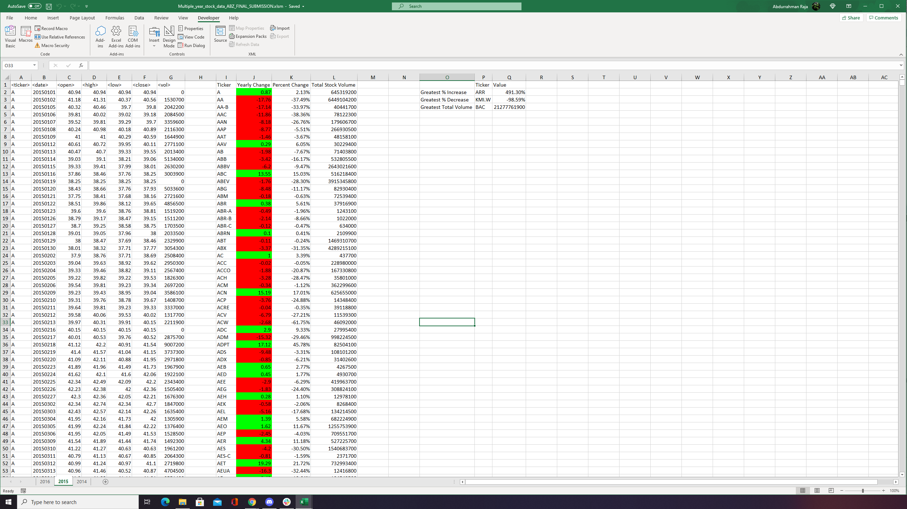
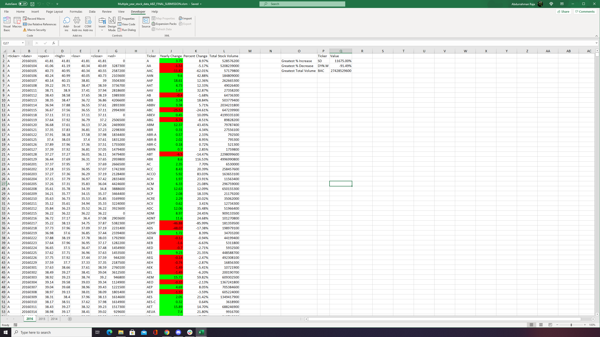

# VBA Stock Market Analysis

There are 3 Years of stock market data in the spreadsheet file, each year on a separate work sheet. The script loops through each sheet and outputs calculated information for each year.

The script outputs Each Unique Ticker Code its finds along with the Yearly Change, Percent Change and Total Stock Volume for each specific Ticker Code. (Columns I-L in example below)

It also outputs a table showing which Ticker had the Greatest Increase, Greatest Decrease and Greatest Volume. (Columns O-Q in example below)

### Example output:

### 2015

### 2016

