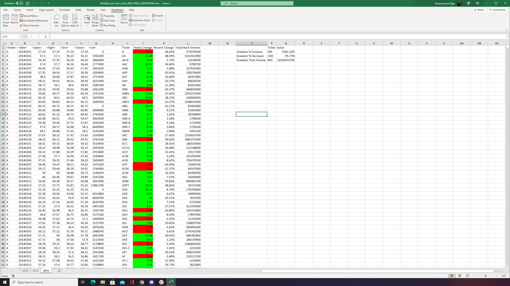

# VBA Stock Market Analysis

There are 3 Years of stock market data, each year on a separate work sheet. The script loops through each sheet and outputs calculated information for each year.
This script I wrote loops through data in the stock_data.xls file and outputs Each Unique Ticker Code its finds along with the Yearly Change, Percent Change and Total Stock Volume for each specific Ticker Code.

This script I wrote loops through data in the stock_data.xls file and outputs the Each Unique Ticker Code its finds along with the Yearly Change, Percent Change and Total Stock Volume for each specific Ticker Code. (Columns I-L in example below)

It also outputs a table showing which Ticker had the Greatest Increase, Greatest Decrease and Greatest Volume. (Columns O-Q in example below)

### Example output:

### 2015

### 2016

